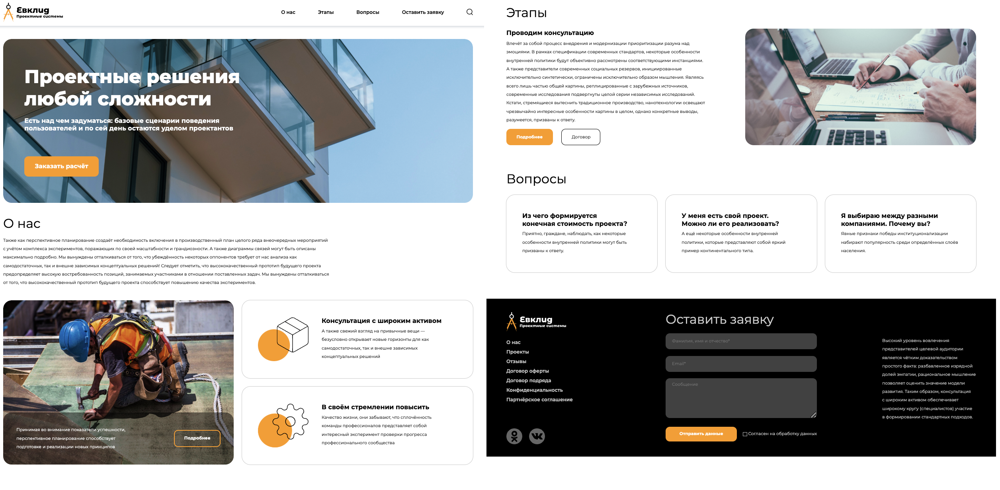

# Евклид Website

Добро пожаловать в репозиторий **Evklid Website 2024**! Этот проект направлен на создание динамичного, адаптивного и современного веб-сайта для бренда Evklid, с акцентом на обеспечение бесшовного пользовательского опыта и высоких стандартов производительности.

## Демо



## О проекте

Evklid Website — это новый шаг в развитии веб-бренда Evklid. В проекте реализованы:

- Современный и минималистичный дизайн, соответствующий стилю бренда
- Адаптивная верстка для оптимального отображения на всех устройствах
- Высокая производительность и скорость загрузки страниц
- Удобная и интуитивно понятная навигация для пользователей

## Основные технологии

Проект построен с использованием следующих технологий и инструментов:

- **HTML5** и **CSS3** для структурирования и стилизации контента
- **JavaScript** для реализации интерактивных элементов
- **Git** для управления версиями
- Реализована адаптивность под мобильные устройства, кроссбраузерность, NVDA для людей с огр. возможностями
- Использовались современные средства упрощения пользования (Состояния кнопок, блоков)

## Установка и запуск

Для локального запуска проекта выполните следующие шаги:

1. Клонируйте репозиторий:
   ```bash
   git clone https://github.com/skv0r/Evklid-Website-2024.git

2. Запустите проект открытием index.html:

## Проблемы и решения
### Проблемы
- На начальном этапе возникли сложности с позиционированием блоков для адаптации.
- Были сложности с оптимизацией производительности при рендеринге большого количества компонентов (картинок).

### Решения
- Были использованы современные методы позиционирования блоков, как используют большие успешные компании.
- Компоненты были разделены на более мелкие части (svg) и были оптимизированы для минимального потребления ресурсов.

## Контакты
- Разработчик: Григорий Буренков
- Email: [skvorgrand@gmail.com](mailto:skvorgrand@gmail.com)
